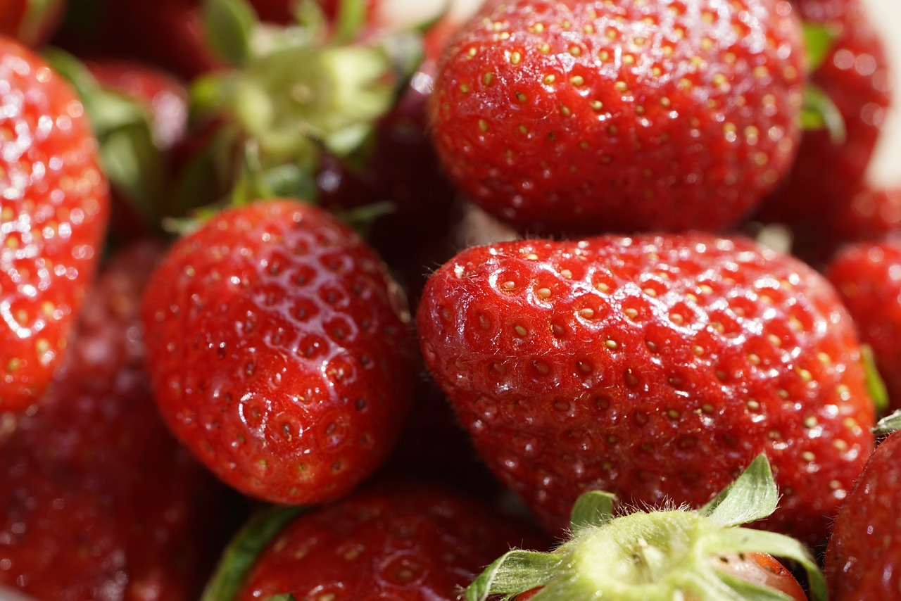

## Fresas: Un Placer Natural y Saludable 🍓

### Introducción

Entre todas las frutas que existen, las fresas se destacan como mi favorita absoluta. No solo son irresistiblemente deliciosas, sino que también están repletas de nutrientes que las convierten en una opción alimenticia excepcional. Su vibrante color rojo, su forma característica y su aroma inconfundible hacen que las fresas sean un auténtico regalo de la naturaleza.

### Sabor y Versatilidad

El sabor de las fresas es una combinación perfecta de dulzura y un toque de acidez, lo que las hace extremadamente versátiles en la cocina. Pueden disfrutarse frescas, directamente del mercado, pero también se prestan para ser el ingrediente estrella en una variedad infinita de recetas. Desde postres clásicos como la tarta de fresas o los batidos, hasta combinaciones más innovadoras como ensaladas con un toque dulce, las fresas aportan ese toque especial que eleva cualquier plato.

### Beneficios para la Salud

Además de su sabor, las fresas son conocidas por sus impresionantes beneficios para la salud. Estas pequeñas frutas son una fuente excelente de **vitamina C**, un potente antioxidante que ayuda a fortalecer el sistema inmunológico y a mantener la piel radiante. También contienen **fibra dietética**, que es esencial para una buena digestión, y **antioxidantes**, que combaten los radicales libres y ayudan a prevenir el envejecimiento prematuro y diversas enfermedades crónicas.

### Fresas en Mi Vida

Para mí, las fresas representan más que una simple comida; son un placer diario que me conecta con la frescura y simplicidad de los productos naturales. Ya sea que las disfrute como un snack rápido, en mi desayuno, o como parte de un postre especial, siempre logran elevar mi estado de ánimo y proporcionar una experiencia sensorial única. 

No es solo su sabor lo que me atrae, sino también la conexión emocional que tengo con esta fruta. Las fresas me recuerdan a los veranos de mi infancia, a las visitas al mercado local y a los momentos de tranquilidad compartidos con amigos y familiares, donde una simple ración de fresas podía convertirse en el centro de una conversación o una tarde de risas.

### Conclusión

En resumen, las fresas no solo son mi comida favorita, sino que también ocupan un lugar especial en mi vida. Su combinación de sabor, beneficios para la salud y versatilidad culinaria las hace insustituibles en mi dieta. Cada bocado de fresa es un recordatorio de la belleza y la generosidad de la naturaleza, y una celebración de los pequeños placeres que hacen la vida más dulce.

¡No puedo imaginar una vida sin las fresas, mi verdadero placer natural!

